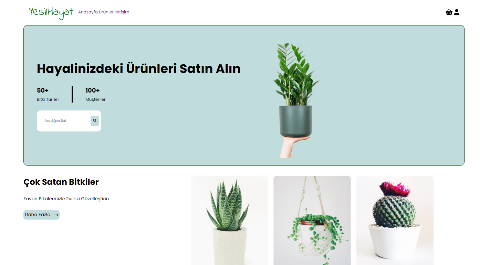
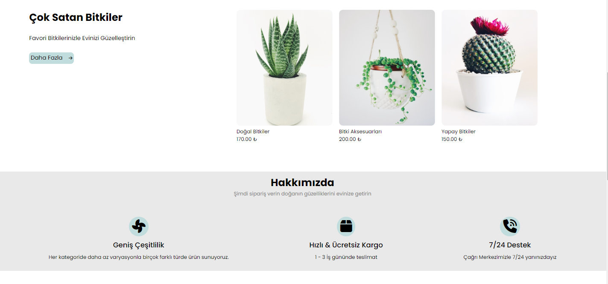
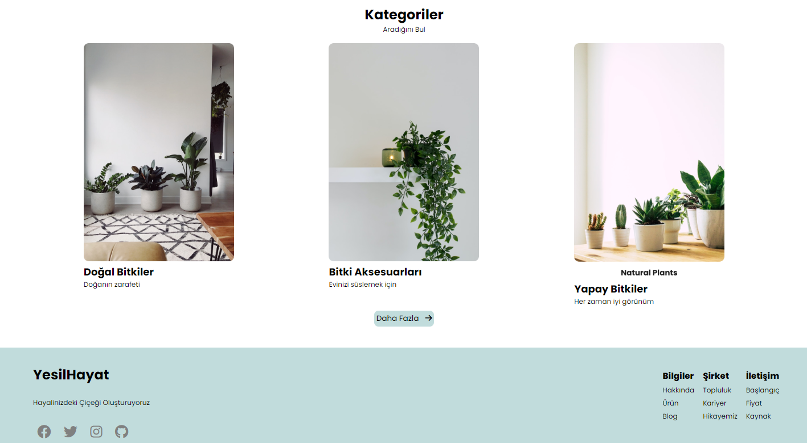

<h1>NFT Proje Denemesi</h1>

Yazılım kursunun ilk haftalarında oluşturduğum ilk projelerdendir.
Bu bir deneme projesi olup statik yapıdadır.

<h2> Kullanılan Teknolojiler</h2>

HTML ve CSS kullanıldı.

<h3>Ekran Görüntüleri</h3>

<h4> Video </h4>

<h4> GIF </h4>

